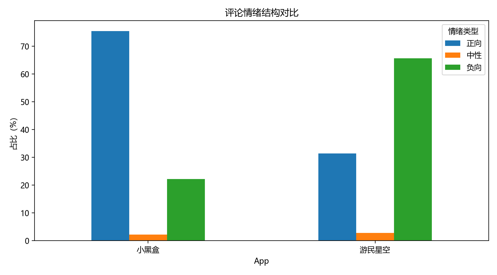
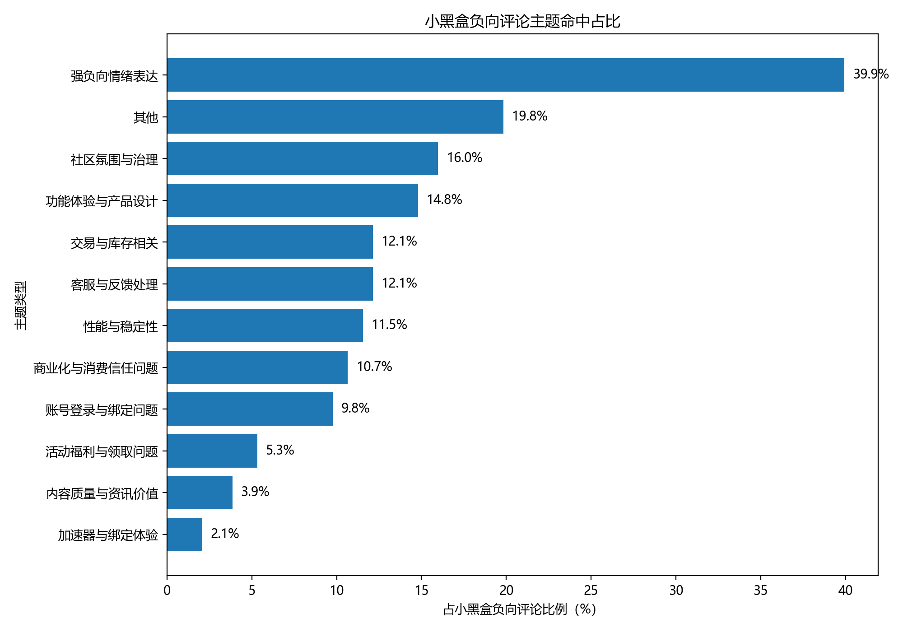
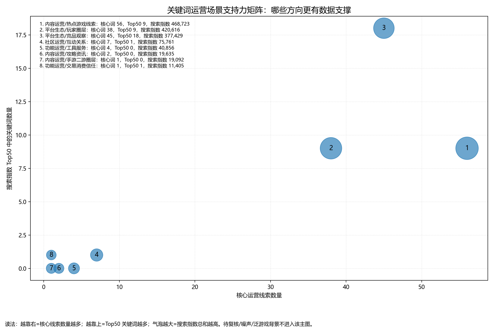
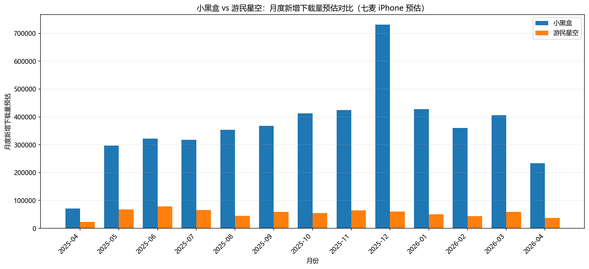
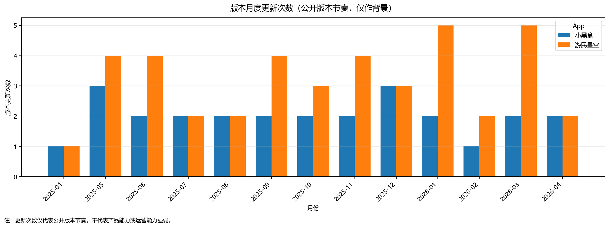
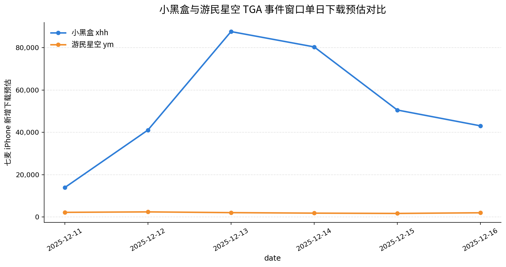

<section class="cover-page">

# 游戏社区 App 运营分析

## 以小黑盒与游民星空为例

**基于公开数据的用户反馈、搜索需求、下载趋势与版本节奏观察**

</section>

> 本报告基于七麦的苹果端公开导出数据，围绕游戏社区 App 的用户反馈、搜索需求、下载趋势和版本节奏进行描述性分析。  
> 公开的评论、关键词、下载预估或版本日志等数据不足以写作因果证明链，故本报告结论均基于公开数据下的交叉观察链。

---

## 1. 项目背景与问题定义

### 1.1 为什么选择游戏社区 App

游戏社区 App 处在游戏内容、玩家关系、工具服务与平台生态的交叉位置。用户使用这类 App 时，并不一定只是为了浏览帖子，也可能围绕热门游戏、攻略资讯、战绩查询、游戏库、Steam 生态、交易库存等场景形成连续需求。

我平时也会使用不同类型的游戏社区和游戏平台，因此对这类产品中“内容、社区、工具和平台生态混在一起”的体验比较熟悉。相比单一内容平台或单一工具产品，游戏社区 App 更适合作为观察玩家需求、内容供给、社区互动和工具服务关系的分析对象。

### 1.2 研究对象选择

本项目选择小黑盒与游民星空作为观察对象，首先是因为我对小黑盒的使用场景相对熟悉，也希望尝试把原本偏用户视角的产品感受，转化为更结构化的运营分析。其次，二者都与游戏内容、玩家社区和工具服务存在关联，但在公开数据中呈现出的产品和运营侧特征并不完全一致。

小黑盒更适合放在玩家社区、Steam 生态、工具服务、交易库存等复合场景中观察；游民星空则更适合结合游戏资讯、攻略内容、热门游戏话题和版本动作进行观察。二者并列分析，有助于将分析从单一 App 体验评价，扩展为对游戏社区 App 运营问题的拆解。

### 1.3 分析目标

由于本项目不具备真实新增、留存、转化、活跃、站内内容消费等内部数据，因此分析目标不是判断两款 App 谁更好，也不是评价两家公司真实运营能力，而是在公开数据边界内回答以下问题：

- 用户在公开评论中表达了哪些体验问题？
- App Store 关键词中出现了哪些主动搜索需求线索？
- 下载趋势在月度维度上呈现出哪些可观察波动？
- 公开版本日志中出现了哪些产品或运营动作背景？
- 这些公开信号可以如何帮助理解游戏社区 App 的运营问题？

---

## 2. 数据来源、分析框架与解释边界

### 2.1 数据来源与正文角色

本项目使用的原始数据主要来自七麦苹果端导出的公开数据，包含评论、关键词、下载预估和版本记录四类。正文中将它们分别作为用户反馈、搜索需求、结果背景和公开动作背景来使用。

| 数据源 | 正文角色 | 能够回答的问题 | 需要注意的点 |
| --- | --- | --- | --- |
| 评论 | 被动反馈：用户在抱怨什么 | 用户在公开评论中表达了哪些不满、障碍、体验问题 | 不能代表全体用户，也不能证明问题真实发生率 |
| 关键词 | 主动需求：用户在寻找什么 | App Store 公开搜索中出现了哪些游戏、社区、工具、平台相关心智 | 不能代表真实流量、真实用户规模或投放效果 |
| 下载趋势 | 结果背景：七麦 iPhone 新增下载预估如何波动 | 不同月份、不同应用的预估下载波动背景 | 不能证明版本、活动或内容导致下载变化 |
| 版本节奏 | 动作背景：公开版本日志中出现什么 | 公开版本更新频率与日志中出现的功能 / 体验动作 | 不能证明评论问题被解决，也不能解释下载高低原因 |

### 2.2 分析框架

本项目采用“交叉观察”作为基本分析框架。这里的交叉观察不是因果验证，而是把不同公开数据放在一起，帮助识别值得继续关注的问题方向。

例如，评论中出现登录、绑定、反馈处理等问题时，版本日志中的相关表述可以作为公开动作背景；关键词中出现热门游戏、攻略资讯或工具类搜索词时，可以帮助理解用户搜索场景；下载趋势出现阶段性高位时，可以将其标记为观察窗口，再结合外部事件、版本日志和公开活动信息进行谨慎讨论。

这种方法的作用是帮助整理问题线索，而不是证明某个动作带来了某个结果。由于缺少站内行为、投放、留存、转化和活动曝光等内部数据，本项目不会把四类数据拼接成“原因—结果”的证明链。

### 2.3 解释边界

在正文写作中，需要遵守以下边界：

- 评论只代表公开评论中被表达出的样例问题，不代表全体用户观点。
- 关键词只作为 App Store 公开搜索需求观察，搜索指数不等同于真实流量或真实用户规模。
- 下载趋势来自七麦 iPhone 新增下载预估，只能作为结果背景，不能作为运营效果证明。
- 版本节奏来自公开版本日志，只能作为动作背景，不能证明具体动作产生了结果。
- 四源数据之间可以互相补充观察角度，但不能构成因果证明链。

---

## 3. 用户反馈与处理

### 3.1 评论情绪结构

用户反馈是非常直接的运营议题。对社区类 App 而言，用户遇到的问题不一定只发生在内容浏览环节，也可能发生在登录、绑定、消息、帖子、工具、稳定性、客服反馈等多个触点。因此，评论分析的价值在于把零散的公开反馈整理成后续可以继续查看的问题线索。

图 1 公开评论样本情绪结构分布。该图仅用于观察公开评论样本中的评分倾向，不代表全部用户满意度。

从评论情绪结构看，公开评论可以被用于识别正向、负向和中性反馈的基本分布，本文仅将其作为用户反馈分层的背景。

| App | 正向 | 中性 | 负向 | 使用边界 |
| --- | ---: | ---: | ---: | --- |
| 小黑盒 | 1147 | 34 | 338 | 主分析对象，用于识别公开评论中的反馈入口 |
| 游民星空 | 44 | 4 | 92 | 样本较少，仅作为辅助观察 |

由于两款 App 评论样本量差异较大，本文不将该结果写成真实用户满意度，也不用于判断两款 App 的整体口碑高低。

### 3.2 负向评论问题分类

负向评论并不天然等于可以直接处理的问题。需要先将抱怨拆成不同层级的问题，再判断哪些问题适合客服响应，哪些问题需要产品协同，哪些问题只能进入长期观察。

图 2 小黑盒公开负向评论规则命中分类。该图基于关键词规则统计负向评论中出现的问题线索，不代表真实问题发生率。

从小黑盒负向评论问题分类看，本图基于规则主题命中统计，统计对象为 338 条小黑盒负向公开评论。完整分类中，“强负向情绪表达”和“其他”占比较高，前者主要反映用户表达情绪较强，后者代表现有关键词规则未能识别出明确问题类别，因此二者不直接作为具体运营问题展开。

在排除“强负向情绪表达”和“其他”后，公开负向评论中较突出的具体问题包括：社区氛围与治理（54 条，15.98%）、功能体验与产品设计（50 条，14.79%）、客服与反馈处理（41 条，12.13%）、交易与库存相关（41 条，12.13%）、性能与稳定性（39 条，11.54%）等。

需要注意的是，一条评论可能同时命中多个问题主题，因此各类型比例不能简单相加为 100%。这些分类的作用，是把公开评论中的零散抱怨整理成后续可以继续查看和分派的问题类型。

### 3.3 代表性评论样例

公开评论中有用户表达过“举报后缺少处理反馈”一类的不满。本文仅将其作为反馈处理问题的观察入口，不代表全部用户观点，也不用于判断该问题的真实发生率。

该样例主要用于说明：在公开评论中，部分用户并不只是在表达负面情绪，而是提出了“反馈处理缺少进度感知”这个具体问题。对于社区类 App，这类表达可以被转化为“反馈是否收到—处理是否推进—结果是否告知”的闭环问题。

### 3.4 从评论到问题处理

从运营处理角度，公开评论中的问题不能只按“好评 / 差评”处理，而需要进一步拆成不同处理路径。

一类是可以直接回复的问题，例如入口位置、基础规则、账号操作、常见功能路径不清楚。这类问题更适合通过评论回复、客服话术、帮助中心或 FAQ 处理。

一类是需要补充信息的问题，例如登录失败、绑定异常、闪退、加载失败等。仅凭一条评论通常很难判断原因，因此需要继续收集设备型号、系统版本、App 版本、发生时间、报错提示和复现路径。

还有一类是需要产品、技术或长期治理协同的问题，例如功能稳定性、消息机制、战绩查询、库存展示、举报处理和社区秩序等。运营侧更适合先完成问题归类、样例整理和优先级标注，而不是直接承诺修复时间或处理结果。

因此，评论分析在本项目中的作用，不是判断某类问题的真实发生率，而是把公开评论中的零散表达整理成后续可以继续跟进的问题线索。后续如果进入真实业务场景，还需要结合客服工单、用户反馈记录、版本变更、站内行为和问题处理结果，才能判断这些问题的真实规模和处理优先级。

---

## 4. 关键词线索

### 4.1 关键词侧的主动搜索需求

关键词数据在本项目中承担“主动需求”角色。与评论不同，关键词不是用户抱怨，而是用户在 App Store 搜索中主动输入的词。它适合用于观察用户搜索心智，尤其是热门游戏、攻略资讯、社区平台、玩家圈层和工具服务相关需求。

本项目将关键词分析作为公开搜索需求样本，用来观察游戏社区 App 相关的内容、平台、工具和社区心智。搜索指数、关键词排名和 Top50 数量等只能用于辅助观察。

从关键词场景汇总结果看，热点游戏共识别到 85 个相关关键词，其中 56 个被保留为核心线索，是本章最重要的观察方向。与此同时，玩家圈层共识别到 81 个相关关键词，其中 38 个为核心线索；竞品观察共识别到 65 个相关关键词，其中 45 个为核心线索。这说明关键词侧的搜索心智并不只围绕具体游戏内容，也包含平台生态、玩家圈层和竞品认知等背景线索。

图 3 关键词运营场景支持力矩阵。横轴表示核心运营线索数量，纵轴表示进入搜索指数 Top50 的关键词数量，气泡大小表示该场景的搜索指数总和。该图仅用于观察不同关键词场景在公开搜索样本中的相对支撑情况，不代表真实流量、真实用户规模或运营效果。

### 4.2 关键词背后的内容需求

从关键词结果看，玩家搜索的并不是一个抽象的“游戏社区”，而是更具体的游戏内容和使用场景。

一类是具体游戏词，例如“永劫无间”“无畏契约”“黑神话悟空”“塞尔达”等。这类词说明，用户进入游戏社区 App 的动机，很多时候不是为了找一个泛泛的交流空间，而是围绕某款游戏寻找资讯、攻略、讨论或玩家评价。

另一类是攻略和资讯词，例如“游戏攻略”“游戏新闻”“游戏资讯”“游戏评测”。这类词对应的是比较直接的内容消费需求：用户想知道怎么玩、值不值得玩、最近有什么变化、其他玩家怎么看。

还有一类是工具和平台相关词，例如游戏库、战绩查询、Steam、主机、助手等。它们说明游戏社区 App 不只是内容阅读场景，也可能承担一部分工具入口和平台连接作用。

因此，关键词分析的价值不在于判断哪个词“流量大”，而在于帮助识别玩家在搜索时到底带着什么需求：看新闻、找攻略、查工具、看评价，还是进入社区讨论。

### 4.3 关键词线索的使用边界

关键词分析在本项目中的作用，不是直接给出内容运营方案，也不是判断哪个方向一定有更高流量，而是帮助识别公开搜索场景中出现过哪些玩家需求。

从这个角度看，具体游戏、攻略资讯、社区讨论和工具平台相关关键词，都可以作为后续观察内容和社区场景的入口。例如，某些热门游戏词可以提示后续关注版本、赛事或玩家讨论；攻略和资讯词可以提示用户存在信息获取需求；工具和平台词则提示游戏社区 App 可能同时承担内容入口和工具入口的角色。

但这些判断都只能停留在“公开搜索线索”层面。后续如果进入真实业务场景，还需要结合站内搜索、内容点击、评论互动、收藏转发、功能使用和留存数据，才能进一步判断这些方向是否真正有效。

---

## 5. 社区氛围与治理

### 5.1 为什么社区氛围与治理值得单独讨论

游戏社区 App 不只是资讯和工具入口，也承载玩家讨论、争议表达、互助问答和内容共创。只要存在讨论和互动，就会涉及内容秩序、举报反馈、封禁感知、评论区冲突和社区氛围等问题。

从公开数据看，社区氛围与治理并不是四源数据中支撑最强的方向。评论侧可以观察到社区、帖子、举报、反馈等表达；关键词侧可以观察到“游戏社区”“游戏论坛”“玩家社区”等搜索心智；但下载趋势和版本节奏几乎不能直接解释治理问题。因此，本章只把它作为一个值得关注的运营议题，而不把它写成对社区整体状态的判断。

### 5.2 评论和关键词中的社区信号

评论侧提供的是被动反馈入口。根据小黑盒负向评论规则命中统计，“社区氛围与治理”相关表达命中 54 条，占 338 条小黑盒负向公开评论的 15.98%。这类表达主要涉及帖子秩序、举报反馈、封禁感知、内容管理和社区互动体验等问题线索。

关键词侧提供的是主动搜索入口。在关键词场景汇总中，“社区运营 / 互动关系”共识别到 15 个相关关键词，其中 7 个被保留为核心线索，代表词包括“游戏社区”“游戏论坛”“玩家社区”等。这说明在 App Store 公开搜索场景中，玩家交流空间和社区入口本身也具有一定搜索心智。

但这些信号只能说明“社区治理值得观察”。它们不能证明社区整体氛围如何，也不能判断真实治理效果。

### 5.3 代表性评论样例

以下样例仅作为公开评论中出现过的治理感知表达，不代表整体社区氛围，也不用于判断真实处理情况。

公开评论中有用户表达过对投诉举报处理、封禁判断和处理反馈的不满。这里使用的是概括表达，并非评论原文，仅作为社区治理感知问题的观察入口。

这个样例说明，部分负向评论并不只是抱怨功能体验，也会涉及用户对举报、封禁和社区秩序的感知。对于社区类 App 来说，这类表达更适合进入“治理问题观察池”，而不是直接被当成平台整体治理质量的证据。

### 5.4 可以继续观察的治理问题

基于评论和关键词，本章更适合把社区治理拆成几个后续观察方向。

第一是内容秩序。公开评论中涉及发帖、删帖、审核、违规、低质量内容等表达时，说明用户可能关注社区内容是否有基本规则，以及规则执行是否清楚。

第二是互动秩序。举报、封禁、误封、屏蔽、禁言等表达，更多反映用户对社区互动环境和处理流程的感知。这类问题不一定能从单条评论判断真假，但可以作为后续整理用户反馈时的标签。

第三是氛围建设。社区治理不只是处理违规内容，也包括如何让优质攻略、玩家问答、经验分享和理性讨论更容易被看见。不过，本项目没有站内内容分发和互动数据，因此只能把这一点作为运营理解，不能写成已经验证的结论。

### 5.5 本章小结

从公开数据看，社区氛围与治理是游戏社区 App 中值得保留的观察方向。评论侧能看到用户对举报、封禁、帖子秩序和处理反馈的表达；关键词侧能看到“游戏社区”“游戏论坛”等社区入口相关搜索心智。

但本项目不能判断小黑盒或游民星空的真实社区氛围，也不能评价具体治理动作是否有效。后续如果进入真实业务场景，还需要结合站内举报记录、审核记录、内容曝光、互动质量、用户申诉和社区规则执行数据，才能进一步判断治理问题的真实规模和处理效果。

---

## 6. 工具服务与功能体验

### 6.1 工具服务为什么影响游戏社区 App 体验

游戏社区 App 的用户体验并不只来自内容浏览和社区讨论。对于玩家而言，游戏库、战绩查询、Steam 绑定、库存展示、加速器、比价、助手类功能等工具服务，也可能成为使用社区 App 的理由。

当工具服务出现登录异常、绑定失败、加载缓慢、数据展示不清晰或功能入口不明确等问题时，用户感知往往不会只停留在单个功能上，而会影响其对整个 App 的整体评价。因此，工具服务可以作为游戏社区 App 中连接内容、社区、平台生态和产品体验的重要场景。

本章不评价具体工具功能优劣，而是关注公开数据中是否能观察到与工具服务、功能体验和产品协同相关的问题线索。

### 6.2 评论、关键词与版本侧的辅助观察

评论侧可以观察到功能体验、稳定性、登录绑定等问题线索。例如，在小黑盒负向评论规则分类中，“功能体验与产品设计”“性能与稳定性”“账号登录与绑定问题”等类别都与工具服务和产品体验有关。

关键词侧则提供了工具服务相关的主动搜索心智。在关键词场景汇总中，“功能运营 / 工具服务”共识别到 8 个相关关键词，其中 4 个被保留为核心线索，代表词包括“游戏库”“月轮加速器”“瓦洛兰特助手”等。这说明在公开搜索样本中，工具或辅助服务也是一类可以被观察到的需求。

版本侧可以提供公开动作背景。部分版本日志中可能出现工具、绑定、查询、体验优化等表述，适合作为后续观察窗口。但版本日志不能证明工具问题已经被解决，也不能说明某个功能动作带来了下载变化。

### 6.3 证据使用边界

本章以评论问题分类、关键词工具服务场景和公开版本日志为辅助证据。由于缺少站内功能使用、留存、转化、故障记录和客服工单等内部数据，本章不判断具体工具功能的真实使用规模，也不评价功能优劣。

即使评论中出现登录、绑定、加载、战绩查询或库存展示等问题表达，也只能说明公开评论样本中存在相关体验线索，不能代表真实问题发生率。版本日志中的优化或修复表述，也只能作为公开动作背景，不能直接写成相关问题已经被解决。

### 6.4 可以继续观察的产品协同问题

从公开数据看，工具服务相关问题更适合被理解为“运营与产品协同”的观察方向，而不是单纯的内容运营问题。

如果用户反馈集中在登录、绑定、加载、查询、库存展示等场景，运营侧首先需要做的不是判断技术原因，而是把用户表达整理成更清楚的问题类型。例如，“打不开”“绑定不了”“查不到战绩”这类表述，本身还不足以定位问题，需要进一步结合设备、版本、操作路径和报错信息等内容。

关键词中的工具类搜索词也可以作为辅助观察。如果某些工具、平台或助手类词反复出现，说明用户可能把游戏社区 App 当作内容、工具和平台连接的复合入口，而不是只把它当作资讯阅读或讨论社区。

因此，本章的重点不是提出具体功能方案，而是说明：工具服务是游戏社区 App 体验中需要运营、产品和技术共同关注的部分。后续如果进入真实业务场景，还需要结合功能使用数据、客服工单、故障记录、用户反馈追踪和版本变更记录，才能判断具体问题的影响范围和处理优先级。

---

## 7. 下载趋势与版本节奏辅助观察

### 7.1 下载趋势：七麦预估下的结果背景

下载趋势在本项目中只作为结果背景。七麦 iPhone 新增下载预估可以帮助观察两款 App 在样本期内的波动情况，但不能直接解释某个活动、版本或热门游戏是否带来了增长。

本项目样本范围为 2025-04-22 至 2026-04-21，小黑盒与游民星空各包含 365 天记录。基于七麦 iPhone 新增下载预估，小黑盒样本期合计为 4,726,228，游民星空样本期合计为 709,852。这个差异只能说明在七麦数据源下，两款 App 的预估下载量级和波动表现不同，不能写成真实用户规模差异。

图 4 小黑盒与游民星空月度下载预估趋势对比。七麦 iPhone 新增下载预估为第三方预估值，仅作为结果波动背景，不代表官方真实下载量或真实用户规模。

从月度汇总看，小黑盒在 2025-12 出现样本期内月度预估最高值，月度预估为 731,333；游民星空的月度高位主要出现在 2025-06，月度预估为 78,797。本文只将这些月份标记为观察窗口，不直接解释其背后的原因。

### 7.2 小黑盒 2025-12 单日高位窗口

从单日数据看，小黑盒在 2025-12-13 出现样本期内单日下载预估最高点，单日预估为 87,585。结合 2025-12-12 至 2025-12-16 的连续高位表现，本文将这几天视为一个连续观察窗口，而不是只关注单日峰值。

| 日期 | 小黑盒七麦 iPhone 新增下载预估 | 游民星空七麦 iPhone 新增下载预估 |
| --- | ---: | ---: |
| 2025-12-11 | 13,904 | 2,194 |
| 2025-12-12 | 41,070 | 2,412 |
| 2025-12-13 | 87,585 | 2,058 |
| 2025-12-14 | 80,350 | 1,818 |
| 2025-12-15 | 50,539 | 1,680 |
| 2025-12-16 | 43,064 | 1,992 |

这个窗口提示后续可以关注外部热点、公开活动、版本动作、渠道投放或站内内容消费等变量。但由于本项目缺少下载来源、活动曝光、注册转化、留存和站内行为数据，因此不能直接完成归因。关于 2025-12 下载高位与 TGA 事件窗口的进一步讨论，本文放在第 8.3 作为方法论边界案例。

### 7.3 版本节奏：公开日志中的动作背景

版本节奏在本项目中只作为公开动作背景。公开版本日志可以显示某个月是否更新更集中，也可以观察日志中是否出现功能优化、体验修复、内容动作或工具动作，但不能证明这些动作带来了下载变化，也不能证明评论中提到的问题已经被解决。

图 5 小黑盒与游民星空公开版本月度更新节奏。版本日志仅作为公开动作背景，不代表产品能力或运营能力强弱。

从版本节奏专项结果看，小黑盒共有 26 条公开版本记录，游民星空共有 41 条公开版本记录。小黑盒版本日志较简略，多数为“修复已知问题”一类表述，因此不适合强行拆解具体功能方向；游民星空版本日志相对具体，能观察到平台账号、购买售后、工具服务、攻略资讯、活动福利等动作线索。

从用户体验视角看，游民星空的部分版本动作已经不只是资讯更新，而是在尝试覆盖账号、工具、活动和用户承接相关能力。这些方向与小黑盒在社区、工具和平台生态上的部分场景存在重合。不过，仅凭公开版本日志，仍不足以判断功能成熟度、用户接受度和实际效果。

### 7.4 下载趋势与版本节奏的使用边界

下载趋势和版本节奏可以共同帮助标记观察窗口，但不能被拼接成因果链。某个月份下载预估处于高位，同时附近存在版本更新，只能写作“该月份值得后续观察”或“版本日志提供了公开动作背景”，不能写作“版本更新导致下载增长”。

同样，版本日志中出现“修复已知问题”“优化体验”等表达，也不能直接写成相关评论问题已经被解决。要验证版本动作是否产生实际效果，还需要站内行为数据、故障数据、客服工单、功能使用数据、留存数据和用户反馈追踪。

因此，第 7 章只提供结果背景和动作背景，不承担下载峰值归因任务。小黑盒 2025-12 下载高位可以作为第 8.3 的方法论边界案例进一步观察，但正式结论仍应保持为“公开数据提示观察窗口”，而不是“公开数据证明增长原因”。

---

## 8. 附录案例与方法论边界

### 8.1 交易、库存与消费信任：补充观察

交易、库存和消费信任相关线索在本项目中的证据强度不如用户反馈、关键词和社区治理主线，因此放在附录中作为补充观察。

评论侧可以观察到相关问题线索。在小黑盒负向评论规则命中统计中，“交易与库存相关”命中 41 条，占 338 条负向公开评论的 12.13%；“商业化与消费信任问题”命中 36 条，占 10.65%。这些表达主要涉及购买、退款、库存展示、订单状态、消费信任等体验问题。

关键词侧也能看到相关搜索心智。例如 Steam 游戏饰品、掌上 Steam、Steam 平台、Steam Guard、Steam 手机令牌、凤凰游戏商城、交易猫助手等关键词，提示用户在 App Store 搜索中存在平台、库存、安全、商城或交易相关需求。但这些关键词不能证明真实交易规模，也不能证明消费信任问题的真实发生率。

以下样例仅作为公开评论中出现过的交易与消费体验表达，不代表全部用户观点，也不用于判断真实问题发生率。

公开评论中有用户表达过对购买端口区分、CDK 使用和退款体验的不满。这里使用的是概括表达，并非评论原文，仅作为交易与消费体验问题的观察入口。

后续如果继续观察这类问题，可以重点关注信息是否清楚、交易和库存状态是否透明、异常问题是否有明确反馈入口等方向。但在本项目中，它仍然只作为次级线索。

### 8.2 活动福利与存量用户体验：探索案例

活动福利不是本项目的核心主线。在关键词核心场景汇总中，活动福利相关线索没有形成足够强的主线支撑；在评论侧，“活动福利与领取问题”命中 18 条，占小黑盒 338 条负向公开评论的 5.33%。

因此，本节只将其作为探索性补充案例。福利、活动、签到、礼包、任务等机制在真实业务中可能与用户回访、参与感或活动体验有关，但仅凭公开关键词、公开评论和下载趋势，无法判断其真实效果。

如果要进一步验证活动福利是否影响用户行为，需要结合活动曝光、参与人数、领取转化、回访频次、留存变化和用户反馈等内部数据。因此，本节只保留为附录观察，不进入核心主线。

### 8.3 小黑盒 2025-12 下载高位：TGA 事件窗口观察

在下载趋势复核中，小黑盒于 2025-12 出现样本期内月度下载预估最高值，月度七麦 iPhone 新增下载预估为 731,333。其中，2025-12-13 为样本期内小黑盒单日下载预估最高点，单日预估值为 87,585。结合 2025-12-12 至 2025-12-16 的连续高位表现，该时间段适合作为后续观察窗口。

图 6 小黑盒与游民星空 TGA 事件窗口单日下载预估对比。该图仅用于展示 2025-12-11 至 2025-12-16 期间七麦 iPhone 新增下载预估的窗口变化，不代表官方真实下载量，也不能证明 TGA 或平台活动导致下载增长。

从外部事件看，The Game Awards 2025 于 2025-12-11 举行，并通过多个平台直播；TGA 官方后续披露，该届节目达到超过 1.71 亿次全球直播观看量。这说明 TGA 属于大型游戏行业事件，适合作为小黑盒 2025-12 下载高位的外部观察变量之一。

从公开活动看，小黑盒存在 TGA2025 年度游戏大选相关活动页，页面信息显示其设置了头像框、成就、年度游戏 CDKEY 抽奖等活动线索。游民星空也存在 TGA2025 游戏大选分会场，页面显示其活动包含投票、抽奖机会等信息；游民社区帖也显示其在 2025-11-18 发布 TGA2025 投票活动，并说明投票会计入官方总票池。也就是说，TGA 期间两款产品均存在相关公开活动承接。

从下载趋势看，小黑盒在 2025-12-13 出现明显单日高位，而游民星空在同一时间窗口内未出现同幅度的下载预估抬升。这种差异提示：大型游戏行业事件、平台活动承接方式、产品使用场景和用户路径都值得进一步观察。但由于本项目缺少活动曝光、下载来源、App 端参与路径、注册转化、账号绑定和留存数据，因此不能将差异直接解释为活动效果或转化效率差异。

因此，本案例更适合作为方法论边界案例，而不是下载峰值归因案例。基于公开数据，本项目只能形成以下克制判断：小黑盒 2025-12 下载高位与 TGA 事件窗口在时间上接近，且同期间存在游戏行业活动和平台投票场景，提示大型游戏热点可能是值得关注的外部观察变量；但不能证明 TGA、平台活动或版本更新导致了下载增长。

| 观察维度 | 可确认的信息 | 不能推出的结论 |
| --- | --- | --- |
| 下载数据 | 小黑盒 2025-12 为样本期月度最高，2025-12-13 为单日最高点 | 不能证明官方真实下载量或真实新增用户 |
| 外部事件 | TGA 2025 于 2025-12-11 举行，并具备大型游戏行业事件属性 | 不能证明 TGA 直接带来下载 |
| 公开活动 | 小黑盒和游民星空均存在 TGA2025 相关公开活动线索 | 不能判断活动转化效率或承接能力强弱 |
| 对照现象 | 游民星空同窗口未出现同幅度下载抬升 | 不能推出小黑盒活动路径更有效 |
| 后续验证 | 需要活动曝光、下载来源、注册转化、端内参与和留存数据 | 公开数据不足以完成因果归因 |

资料来源说明：TGA 举办时间、直播观看量和平台分发信息来自 The Game Awards 官方公开信息；小黑盒活动信息来自小黑盒 TGA2025 公开活动页；游民星空活动信息来自游民星空 TGA2025 分会场和社区帖。上述来源仅用于确认外部事件和公开活动存在，不用于证明下载峰值原因。

---

## 9. 综合发现与项目限制

### 9.1 综合发现

基于评论、关键词、下载趋势和版本节奏四类公开数据，本项目形成了以下观察。

第一，公开评论可以帮助识别用户反馈中的问题入口。小黑盒负向评论中不仅有强烈情绪表达，也出现了账号登录、功能体验、客服反馈、交易库存、性能稳定性和社区秩序等具体问题线索。这些反馈不适合直接写成真实问题发生率，但可以作为后续整理问题标签和处理优先级的参考。

第二，关键词显示用户搜索需求并不只围绕“社区”本身。热门游戏、攻略资讯、平台生态、工具服务和社区互动等关键词共同说明，游戏社区 App 承接的是复合场景：用户可能是来找游戏资讯、查攻略、看评价、用工具，也可能是进入社区讨论。

第三，社区氛围与治理值得保留为独立观察方向。评论侧的举报、反馈、封禁、帖子秩序等表达，以及关键词侧的社区相关搜索心智，都提示社区治理是游戏社区 App 中不可忽视的问题。但公开数据不足以代表整体社区状态，因此本项目不对社区氛围或治理效果作强判断。

第四，工具服务和功能体验会影响用户对社区 App 的整体评价。游戏库、战绩查询、Steam 绑定、库存展示、助手工具等场景说明，游戏社区 App 不只是内容平台，也承担一定工具和平台连接作用。这类问题通常需要结合产品、技术和客服数据继续判断。

第五，下载趋势和版本节奏只能作为辅助背景。七麦 iPhone 新增下载预估是第三方预估，版本日志是公开文本，二者可以帮助标记观察窗口，但不能用于证明版本、活动或内容动作带来了下载增长，也不能证明评论中提到的问题已经被解决。

### 9.2 后续如果进入真实业务场景，需要补充什么

本项目的核心限制在于数据来源全部来自公开数据。公开数据适合帮助发现问题线索，但不足以完成效果验证和因果归因。

如果后续进入真实业务场景，至少需要补充几类数据：

- 用户行为数据：如站内活跃、留存、访问路径、功能使用、内容点击和搜索记录，用于判断用户真实使用情况。
- 内容互动数据：如评论、收藏、转发、点赞、停留时长和专题页表现，用于判断内容方向是否真正有效。
- 客服与反馈数据：如客服工单、问题处理状态、用户申诉、举报记录和处理结果，用于判断公开评论中问题线索的真实规模。
- 活动与渠道数据：如活动曝光、参与人数、下载来源、注册转化和留存变化，用于判断外部热点或平台活动是否产生实际影响。
- 版本与故障数据：如版本发布后的功能使用变化、故障记录、崩溃率和用户反馈追踪，用于判断版本动作是否真的改善体验。

这些数据能够把本项目中的“公开观察线索”进一步转化为真实业务中的验证问题。

### 9.3 项目限制

本项目基于公开数据完成，因此存在明确限制。

首先，七麦 iPhone 新增下载量预估是第三方预估值，不能代表官方真实下载量、真实新增用户或真实用户规模。其次，App Store 评论只代表公开评论用户，不能代表全部用户观点或真实问题发生率。第三，关键词搜索指数只能观察 App Store 搜索心智，不能代表真实流量、下载转化或投放效果。第四，版本日志是公开文本，无法代表完整产品战略、真实迭代计划或功能修复效果。

因此，本项目的价值不在于完成增长归因，而在于基于公开数据识别用户反馈、搜索需求、社区治理、工具服务和外部热点等运营问题线索，并形成可继续验证的分析框架。公开数据适合帮助发现问题，但不能替代内部数据完成效果判断。
